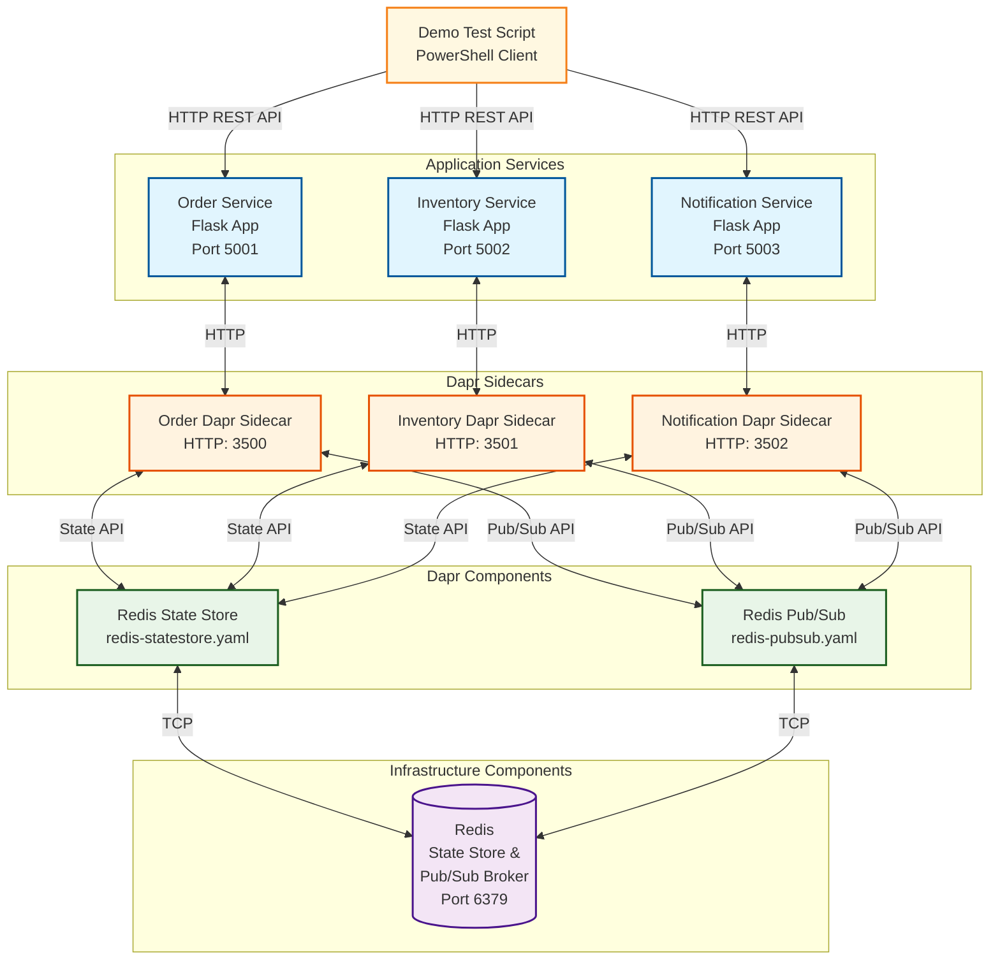
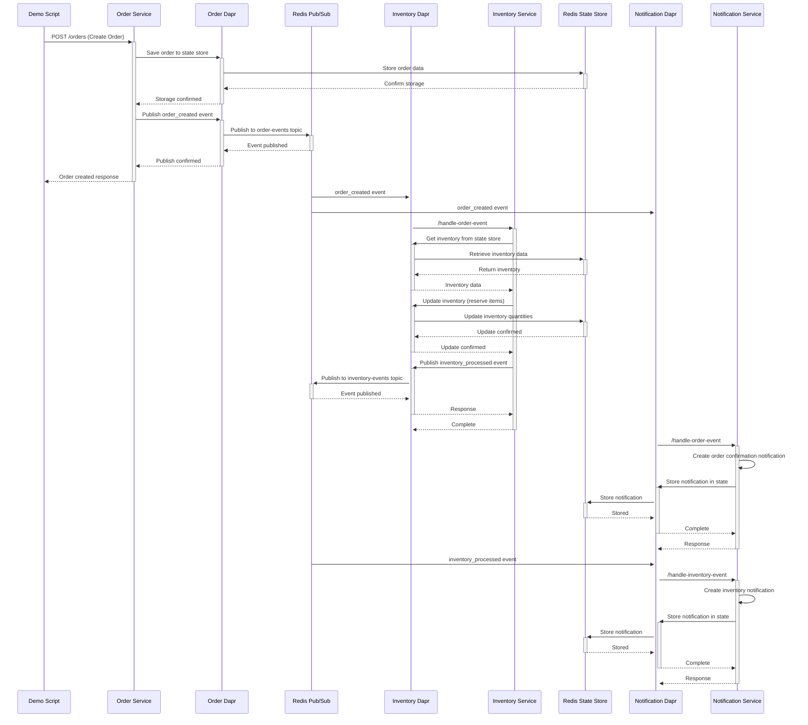
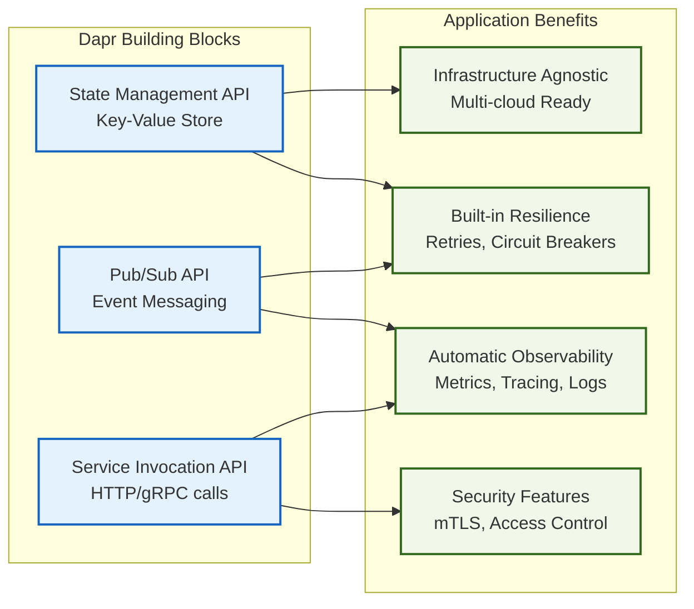
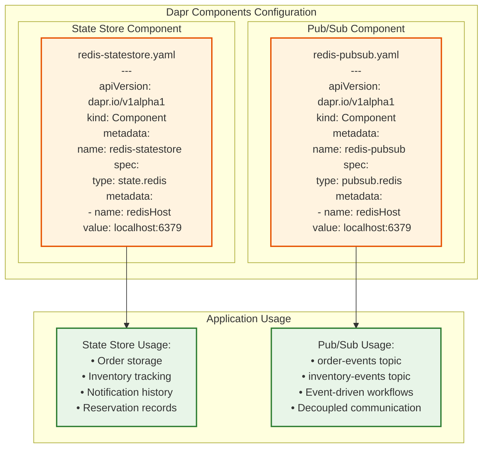

# Dapr Microservices Architecture

This document describes the architecture of the Dapr-based microservices demo, showing how Dapr facilitates service communication, state management, and event-driven messaging.

## Overall Architecture

## Data Flow and Event Sequence

## Dapr Building Blocks Used

## Component Configuration

## Key Dapr Features Demonstrated

### 1. **State Management**
- **What Dapr Does**: Provides a consistent key-value API across different state stores
- **In Our Solution**: 
  - Orders stored as `order:{order_id}`
  - Inventory tracked as `inventory:{product_id}`
  - Notifications stored as `notification:{notification_id}`
  - Reservations tracked as `reservation:{order_id}:{product_id}`

### 2. **Pub/Sub Messaging**
- **What Dapr Does**: Abstracts message broker complexities with standard publish/subscribe API
- **In Our Solution**:
  - `order-events` topic for order lifecycle events
  - `inventory-events` topic for inventory status updates
  - Automatic event delivery to subscribers
  - CloudEvents format standardization

### 3. **Service Discovery & Communication**
- **What Dapr Does**: Simplifies service-to-service communication with built-in service discovery
- **In Our Solution**: Each service communicates through its Dapr sidecar using standard HTTP

### 4. **Infrastructure Abstraction**
- **What Dapr Does**: Provides pluggable components for different infrastructure providers
- **In Our Solution**: Redis components can be swapped for other providers (Azure Service Bus, AWS SQS, etc.) without code changes

## Benefits of This Architecture

1. **Loose Coupling**: Services communicate through events, not direct calls
2. **Resilience**: Dapr handles retries, timeouts, and circuit breaking
3. **Observability**: Automatic metrics and tracing across all services
4. **Portability**: Same code works across different cloud providers
5. **Simplified Development**: Developers focus on business logic, not infrastructure concerns
6. **Event-Driven**: Reactive architecture that scales based on demand